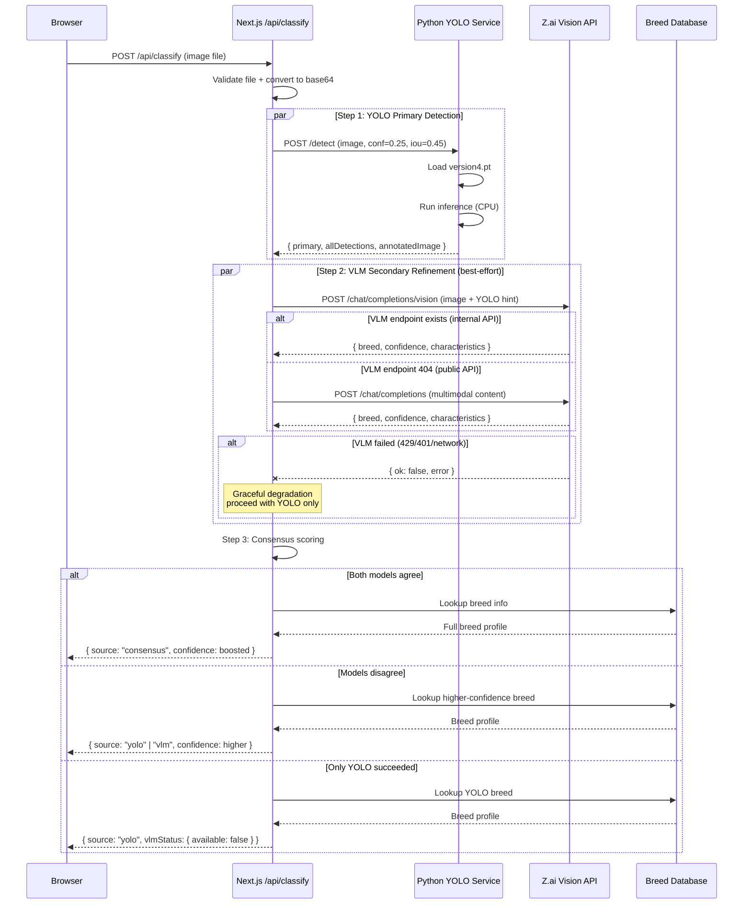
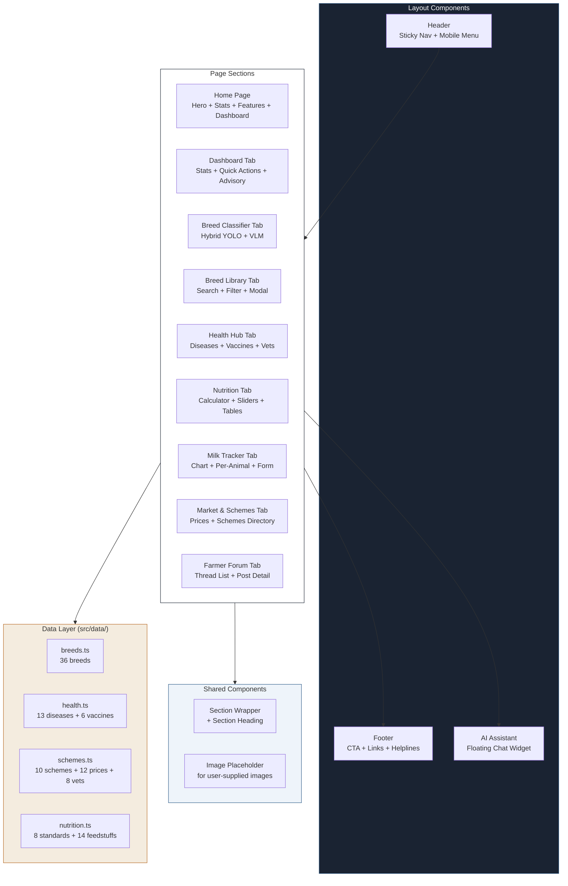
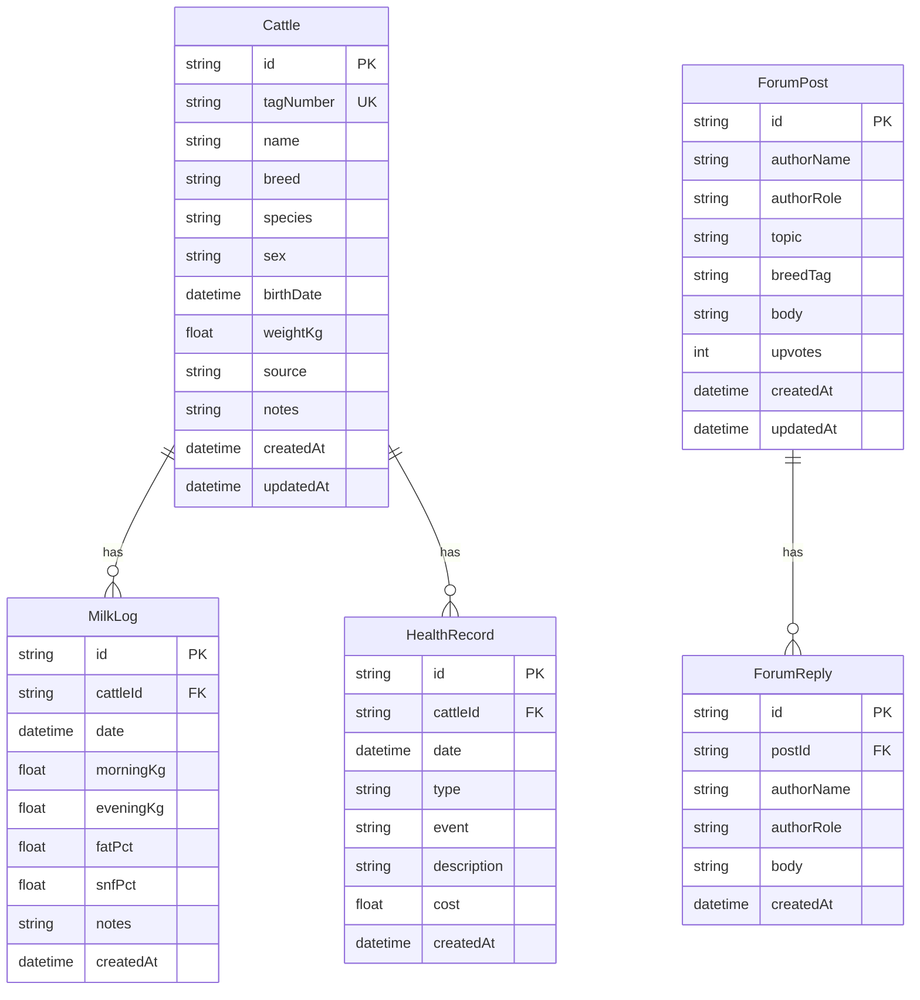

# PashuMitra — Indian Bovine Intelligence Platform

> A one-stop, end-to-end platform for Indian cattle and buffalo management — built for farmers, dairies, and veterinarians across India.

[](https://nextjs.org/)
[](https://www.typescriptlang.org/)
[](https://tailwindcss.com/)
[](https://python.org/)
[](https://prisma.io/)
[](LICENSE)

---

## Table of Contents

1. [Overview](#overview)
2. [Key Features](#key-features)
3. [Architecture](#architecture)
4. [Technology Stack](#technology-stack)
5. [Project Structure](#project-structure)
6. [Prerequisites](#prerequisites)
7. [Installation & Setup](#installation--setup)
8. [YOLO Model Integration](#yolo-model-integration)
9. [Z.ai API Configuration](#zai-api-configuration)
10. [Environment Variables](#environment-variables)
11. [API Reference](#api-reference)
12. [Database Schema](#database-schema)
13. [Usage Guide](#usage-guide)
14. [Asset Placement Guide](#asset-placement-guide)
15. [Troubleshooting](#troubleshooting)
16. [Contributing](#contributing)
17. [License](#license)
18. [Acknowledgements](#acknowledgements)

---

## Overview

**PashuMitra** (Sanskrit: "friend of animals") is a comprehensive digital platform purpose-built for India's bovine sector — the world's largest, with over 303 million cattle and buffalo and 230+ million tonnes of annual milk production. The platform unifies breed identification, health management, nutrition science, production tracking, market intelligence, and government scheme access into a single, modern web application.

Unlike fragmented tools that address only one aspect of bovine management, PashuMitra delivers an integrated workflow: a farmer can photograph an animal, identify its breed with AI, look up its health risks, calculate its daily feed ration, log its milk yield, check today's mandi price, and apply for a government subsidy — all from one dashboard.

The platform is designed for Indian conditions: it speaks Hinglish, references Indian breeds (Gir, Sahiwal, Murrah, etc.), aligns with ICAR-NIANP feeding standards, and surfaces central government schemes (Rashtriya Gokul Mission, Pashu KCC, AHIDF). The UI is built with an Indian-context palette (deep blue, dark navy, amber, green) and is fully responsive for low-bandwidth rural internet.

### Who is it for?

| Audience | Primary use cases |
|---|---|
| **Smallholder dairy farmers** | Identify breeds, track milk, access schemes, get vet guidance |
| **Progressive dairy owners** | Manage herd records, monitor production trends, optimise feed costs |
| **Veterinarians & paravets** | Quick disease reference, vaccination scheduling, client education |
| **Livestock extension officers** | Scheme directory, training material, market price dissemination |
| **Breed conservationists** | Indigenous breed database, conservation status tracking, pedigree reference |
| **Researchers & students** | Standardised breed data, disease database, nutrition calculators |

---

## Key Features

### 1. AI Breed Classifier (Hybrid YOLO + VLM)
- **Primary detection**: Your trained YOLO model (`version4.pt`) identifies the breed with bounding-box localization
- **Secondary refinement**: A vision-language model (Z.ai GLM-4.6V) validates the YOLO prediction, adds observed visual characteristics, and provides independent confidence scoring
- **Consensus scoring**: When both models agree, confidence is boosted; when they disagree, the higher-confidence result wins
- **Graceful degradation**: If the VLM is unavailable (no API balance, network error), the classifier returns a YOLO-only result with a clear notice — YOLO is the primary detector and works standalone

### 2. Breed Encyclopedia
- Database of **36 bovine breeds** — 26 indigenous cattle, 4 buffalo breeds (Murrah, Mehsana, Jaffarabadi, Surti), and 6 exotic breeds used in Indian crossbreeding (Holstein Friesian, Jersey, Brown Swiss, Guernsey, Red Dane, Ayrshire)
- Full profiles: origin, region, milk yield, fat %, body weight, coat colour, horn type, temperament, heat tolerance, disease resistance, conservation status
- Searchable and filterable by category (indigenous/exotic), species (cattle/buffalo), and primary use (dairy/dual/draught)
- Detail modal with distinguishing features and conservation notes

### 3. Health & Vaccination Hub
- **Disease library**: 13 major bovine diseases (FMD, HS, BQ, Brucellosis, Mastitis, Theileriosis, Fascioliasis, Hypocalcaemia, Ketosis, and more) with symptoms, causes, transmission, prevention, treatment, vaccine availability, incubation period, and mortality rate
- **Vaccination schedule**: NDBB-aligned schedule for FMD, HS, BQ, Brucellosis, Theileriosis, and Enterotoxaemia — with age at first dose, booster interval, timing, route, and dose
- **Veterinary directory**: 8 types of veterinary resources (district hospitals, primary centres, mobile units, university hospitals, KVKs, cooperative services, private practitioners, goshalas) with contact and service details

### 4. Nutrition Calculator
- ICAR-NIANP-based feed calculator with 4 interactive sliders (body weight, milk yield, fat %, months pregnant) and animal class selector
- Outputs daily ration: green fodder, dry roughage, concentrate mix, mineral mixture, salt, and water — with estimated daily cost
- Nutrient requirements: dry matter, DCP, TDN, calcium, phosphorus, vitamins
- Reference table of 14 common Indian feedstuffs with composition (DM%, CP%, TDN%, cost)
- Seasonal advisory for heat stress, cold stress, monsoon, fodder scarcity, calving, and lactation peak

### 5. Milk Production Tracker
- Log daily morning and evening yields per animal (Prisma-backed, persistent)
- 14-day production trend bar chart
- Per-animal performance breakdown with average and total yields
- Recent logs table with fat % tracking
- Stats dashboard: today's total, 14-day average, 14-day total, active animal count

### 6. Market & Schemes
- **Mandi prices**: 12 commodities (cow milk, buffalo milk, A2 milk, ghee, Gir heifer, Murrah buffalo, Sahiwal cow, crossbred heifer, green fodder, wheat straw, jowar hay, concentrate mix) with modal/min/max prices and trend indicators
- **Government schemes**: 10 central schemes (Rashtriya Gokul Mission, NPDD, Pashu KCC, Pashu Bima, DIDF, AHIDF, DEDS, SMPP, e-Raksha, Semen Station Modernisation) with eligibility, benefit, subsidy %, required documents, and application process

### 7. Farmer Forum
- Community discussion board for farmers, dairies, and veterinarians
- Threaded posts with breed tags, author roles, and upvotes
- Pre-seeded with realistic discussions (summer fodder for Gir, Punganur calf rearing, Murrah auction results)

### 8. AI Assistant (Floating Chat)
- PashuMitra AI chatbot powered by Z.ai GLM-4.6 with full bovine knowledge context (all breeds, diseases, schemes)
- Responds in Hinglish/English matching the user's language
- 6 suggested prompts for common questions
- Conversation history (last 6 messages) for context

### 9. Farmer Dashboard
- Live stats from the database (registered animals, today's milk, log count)
- 6 quick-action cards linking to all major sections
- Today's bovine advisory (weather, vaccination reminders, fodder planning)
- Market snapshot grid with 6 key commodity prices

---

## Architecture

PashuMitra uses a **three-tier microservices architecture**: a Next.js full-stack application for the UI and CRUD APIs, a separate Python FastAPI service for YOLO inference, and an external Z.ai API for vision-language refinement.

> **Downloadable diagrams**: High-resolution PNG versions are available in `/download/`:
> - [`pashumitra-architecture.png`](./download/pashumitra-architecture.png) — High-level system architecture
> - [`pashumitra-hybrid-flow.png`](./download/pashumitra-hybrid-flow.png) — Hybrid YOLO + VLM classification sequence

### High-Level Architecture

```mermaid
flowchart TB
    subgraph Client["Client Browser"]
        UI["React UI<br/>(Next.js 16 App Router)"]
    end

    subgraph NextJS["Next.js Application (Port 3000)"]
        direction TB
        SSR["Server Components<br/>(SSR + RSC)"]
        APIRoutes["API Routes<br/>(Edge + Node.js runtime)"]
        PrismaClient["Prisma Client"]
        
        subgraph APIs["REST API Endpoints"]
            ClassifyAPI["/api/classify<br/>(Hybrid YOLO + VLM)"]
            ChatAPI["/api/chat<br/>(LLM Assistant)"]
            YoloHealthAPI["/api/yolo-health<br/>(Status Proxy)"]
            CattleAPI["/api/cattle<br/>(CRUD)"]
            MilkLogAPI["/api/milk-log<br/>(CRUD)"]
            HealthAPI["/api/health-record<br/>(CRUD)"]
            ForumAPI["/api/forum<br/>(CRUD)"]
        end
        
        SSR --> APIRoutes
        APIRoutes --> APIs
        APIs --> PrismaClient
    end

    subgraph PythonService["Python FastAPI Service (Port 8501)"]
        direction TB
        Uvicorn["Uvicorn ASGI Server"]
        FastAPI["FastAPI App"]
        YoloModel["YOLO Model<br/>(version4.pt)"]
        Ultralytics["Ultralytics 8.4.92"]
        TorchCPU["PyTorch 2.13 (CPU)"]
        
        Uvicorn --> FastAPI
        FastAPI --> Ultralytics
        Ultralytics --> YoloModel
        Ultralytics --> TorchCPU
    end

    subgraph External["External Services"]
        ZaiAPI["Z.ai API<br/>(GLM-4.6V Vision + GLM-4.6 Chat)"]
    end

    subgraph Data["Data Layer"]
        SQLite[("SQLite Database<br/>(via Prisma)")]
        BreedData["Breed Database<br/>(36 breeds)"]
        HealthData["Health Database<br/>(13 diseases)"]
        SchemeData["Scheme Database<br/>(10 schemes)"]
        NutritionData["Nutrition Database<br/>(14 feedstuffs)"]
    end

    UI <-->|HTTP / WebSocket| SSR
    UI <-->|fetch()| APIs
    
    ClassifyAPI -->|1. POST /detect<br/>(image upload)| FastAPI
    ClassifyAPI -->|2. POST /chat/completions<br/>(image + YOLO hint)| ZaiAPI
    ClassifyAPI -->|3. Consensus scoring| ClassifyAPI
    
    ChatAPI -->|POST /chat/completions| ZaiAPI
    YoloHealthAPI -->|GET /health| FastAPI
    
    PrismaClient <--> SQLite
    APIRoutes --> BreedData
    APIRoutes --> HealthData
    APIRoutes --> SchemeData
    APIRoutes --> NutritionData
    
    style Client fill:#EEF4FA,stroke:#2D5A87
    style NextJS fill:#FFFFFF,stroke:#1A2332
    style PythonService fill:#FEF3E0,stroke:#F2A93B
    style External fill:#E8F5E9,stroke:#4CAF50
    style Data fill:#F4ECDF,stroke:#B5651D
```

### Hybrid Classification Flow (Detailed)



### Data Flow Diagram

```mermaid
flowchart LR
    subgraph Inputs["User Inputs"]
        ImgUpload[Image Upload]
        ChatMsg[Chat Message]
        MilkLog[Milk Log Entry]
        NewCattle[New Cattle Registration]
        ForumPost[Forum Post]
    end
    
    subgraph Processing["Processing Layer"]
        ClassifyRoute[/api/classify]
        ChatRoute[/api/chat]
        MilkRoute[/api/milk-log]
        CattleRoute[/api/cattle]
        ForumRoute[/api/forum]
    end
    
    subgraph AI["AI Services"]
        YOLO[YOLO Service<br/>Port 8501]
        ZAI[Z.ai API<br/>GLM-4.6V / GLM-4.6]
    end
    
    subgraph Storage["Storage"]
        DB[(SQLite<br/>Prisma ORM)]
        StaticData[Static Data Files<br/>breeds.ts, health.ts,<br/>schemes.ts, nutrition.ts]
    end
    
    subgraph Outputs["UI Outputs"]
        Dashboard[Dashboard]
        Classifier[Classifier Result]
        Chatbot[AI Assistant]
        Tracker[Milk Tracker]
        Encyclopedia[Breed Library]
        HealthHub[Health Hub]
        Market[Market & Schemes]
    end
    
    ImgUpload --> ClassifyRoute
    ChatMsg --> ChatRoute
    MilkLog --> MilkRoute
    NewCattle --> CattleRoute
    ForumPost --> ForumRoute
    
    ClassifyRoute --> YOLO
    ClassifyRoute --> ZAI
    ClassifyRoute --> StaticData
    ClassifyRoute --> Classifier
    
    ChatRoute --> ZAI
    ChatRoute --> StaticData
    ChatRoute --> Chatbot
    
    MilkRoute --> DB
    CattleRoute --> DB
    ForumRoute --> DB
    
    DB --> Dashboard
    DB --> Tracker
    StaticData --> Encyclopedia
    StaticData --> HealthHub
    StaticData --> Market
    
    style Inputs fill:#EEF4FA,stroke:#2D5A87
    style Processing fill:#FFFFFF,stroke:#1A2332
    style AI fill:#FEF3E0,stroke:#F2A93B
    style Storage fill:#F4ECDF,stroke:#B5651D
    style Outputs fill:#E8F5E9,stroke:#4CAF50
```

### Component Architecture



---

## Technology Stack

### Frontend
| Technology | Version | Purpose |
|---|---|---|
| **Next.js** | 16 (App Router) | Full-stack React framework with SSR, RSC, API routes |
| **TypeScript** | 5 | Type-safe development |
| **Tailwind CSS** | 4 | Utility-first styling with custom brand tokens |
| **shadcn/ui** | New York | Component library (Radix UI primitives) |
| **Lucide React** | Latest | Icon library (no emojis) |
| **Montserrat + Inter** | Google Fonts | Display + body typography |

### Backend (Next.js API Routes)
| Technology | Version | Purpose |
|---|---|---|
| **Next.js API Routes** | 16 | REST API endpoints (Node.js runtime) |
| **Prisma ORM** | 6 | Type-safe database access |
| **SQLite** | Built-in | Embedded database (file-based) |
| **Zod** | Latest | Runtime type validation |

### AI / ML Services
| Technology | Version | Purpose |
|---|---|---|
| **Python** | 3.12 | YOLO inference runtime |
| **FastAPI** | 0.115 | Python API framework for YOLO service |
| **Ultralytics** | 8.4.92 | YOLO model loading and inference |
| **PyTorch** | 2.13 (CPU) | Deep learning backend |
| **Pillow** | 11.0 | Image processing |
| **Z.ai GLM-4.6V** | API | Vision-language model for breed refinement |
| **Z.ai GLM-4.6** | API | Chat model for AI assistant |

### Development Tools
| Tool | Purpose |
|---|---|
| **Bun** | Package manager and runtime |
| **ESLint** | Code linting |
| **Prisma Studio** | Database inspection (`bun run db:studio`) |

---

## Project Structure

```
pashumitra/
├── public/                          # Static assets (user-supplied images)
│   ├── breeds/                      # Breed photos: {breed-id}.jpg
│   ├── hero/                        # Hero images
│   ├── IMAGE-GUIDE.md              # Asset placement instructions
│   ├── logo.svg
│   └── robots.txt
│
├── python-services/
│   └── yolo-detector/               # Python FastAPI micro-service
│       ├── models/
│       │   └── version4.pt          # ← User places trained YOLO model here
│       ├── main.py                  # FastAPI app with /health and /detect
│       ├── requirements.txt         # Python dependencies
│       ├── start.sh                 # Service launcher script
│       ├── service.log              # Runtime logs
│       ├── service.pid              # PID file
│       └── README.md                # YOLO service setup guide
│
├── prisma/
│   └── schema.prisma                # Database schema (Cattle, MilkLog, HealthRecord, ForumPost, ForumReply)
│
├── scripts/
│   └── seed.ts                      # Database seed script (demo cattle, milk logs, forum posts)
│
├── src/
│   ├── app/                         # Next.js App Router
│   │   ├── layout.tsx               # Root layout (Montserrat + Inter fonts, metadata)
│   │   ├── page.tsx                 # Home page (tab navigation state)
│   │   ├── globals.css              # Tailwind + brand tokens + custom utilities
│   │   └── api/                     # REST API routes
│   │       ├── classify/route.ts    # Hybrid YOLO + VLM breed classification
│   │       ├── chat/route.ts        # AI assistant (GLM-4.6 chat)
│   │       ├── yolo-health/route.ts # YOLO service status proxy
│   │       ├── cattle/route.ts      # Cattle CRUD
│   │       ├── milk-log/route.ts    # Milk log CRUD
│   │       ├── health-record/route.ts # Health record CRUD
│   │       └── forum/route.ts       # Forum post CRUD
│   │
│   ├── components/
│   │   ├── layout/                  # Header, Footer, AIAssistant
│   │   ├── sections/                # Page sections (Hero, Dashboard, Classifier, etc.)
│   │   └── ui/                      # shadcn/ui components (Button, Card, Dialog, etc.)
│   │
│   ├── data/                        # Static knowledge databases
│   │   ├── breeds.ts                # 36 bovine breeds with full profiles
│   │   ├── health.ts                # 13 diseases + 6-vaccine schedule
│   │   ├── schemes.ts               # 10 govt schemes + 12 mandi prices + 8 vet sources
│   │   └── nutrition.ts             # 8 feeding standards + 14 feedstuffs + calculator
│   │
│   ├── hooks/                       # React hooks (use-mobile, use-toast)
│   └── lib/                         # Utilities (db, utils)
│
├── .z-ai-config                     # Z.ai API config (apiKey + baseUrl) — user creates this
├── Caddyfile                        # Gateway config (sandbox only)
├── package.json
├── tsconfig.json
├── tailwind.config.ts
├── eslint.config.mjs
├── next.config.ts
└── README.md                        # This file
```

---

## Prerequisites

Before you begin, ensure you have the following installed:

### Required
- **Node.js** 18+ and **npm** (or **Bun** 1.1+ — recommended)
- **Python** 3.10+ with **pip**
- **Git** for cloning the repository

### Optional (for YOLO service)
- **Your trained YOLO model** (`version4.pt`) — placed in `python-services/yolo-detector/models/`

### Accounts
- **Z.ai API key** (optional but recommended) — get one at https://z.ai/manage-apikey
  - Free tier available
  - Powers the VLM refinement layer and AI chatbot
  - The classifier works standalone with YOLO if Z.ai is unavailable

---

## Installation & Setup

### Step 1: Clone the repository

```bash
git clone <your-repo-url> pashumitra
cd pashumitra
```

### Step 2: Install Node.js dependencies

```bash
# Using npm
npm install

# OR using Bun (faster — recommended)
bun install
```

### Step 3: Set up the database

The project uses SQLite via Prisma. The database file is created automatically.

```bash
# Push the Prisma schema to create tables
bun run db:push
# or: npx prisma db push

# (Optional) Seed the database with demo data
bun run scripts/seed.ts
# or: npx tsx scripts/seed.ts
```

This creates 3 demo cattle, 42 milk logs (14 days × 3 animals), 4 health records, and 3 forum posts so you can explore the app immediately.

### Step 4: Start the Next.js dev server

```bash
bun run dev
# or: npm run dev
```

The app will be available at **http://localhost:3000**.

### Step 5: (Optional) Start the YOLO Python service

If you want breed classification with your trained YOLO model:

```bash
cd python-services/yolo-detector

# Install Python dependencies (one-time)
pip install -r requirements.txt
pip install torch torchvision --index-url https://download.pytorch.org/whl/cpu

# Place your model file
# Copy version4.pt to python-services/yolo-detector/models/version4.pt

# Start the service
python -m uvicorn main:app --host 0.0.0.0 --port 8501
```

The YOLO service runs at **http://localhost:8501**. Verify with:
```bash
curl http://localhost:8501/health
# Expected: { "status": "ok", "model_loaded": true, "classes": [...] }
```

### Step 6: (Optional) Configure Z.ai API

See [Z.ai API Configuration](#zai-api-configuration) below.

---

## YOLO Model Integration

PashuMitra uses your trained YOLO model (`version4.pt`) as the **primary breed detector**. The model is loaded by a separate Python FastAPI service to keep the ML runtime isolated from the Next.js app.

### How it works

1. The Next.js `/api/classify` endpoint receives an image upload
2. It forwards the image to the Python service at `http://localhost:8501/detect`
3. The Python service runs YOLO inference on CPU and returns:
   - **Primary detection**: highest-confidence breed + confidence score
   - **All detections**: every detected object with bounding boxes
   - **Annotated image**: the original image with bounding boxes drawn (base64 JPEG)
4. The Next.js endpoint then optionally calls the Z.ai VLM to refine the result
5. Both results are combined with consensus scoring and returned to the UI

### Placing your model

Copy your trained `version4.pt` file to:

```
python-services/yolo-detector/models/version4.pt
```

The service auto-detects the file on next restart. If the file is missing, the service starts in **degraded mode** and the Next.js classifier falls back to VLM-only.

### Model classes

Your model should output class names that match (or closely resemble) the breed names in `src/data/breeds.ts`. The classifier uses fuzzy matching to link YOLO's class names to the breed database. For example:
- YOLO class `"Gir"` → matches breed `"Gir"` ✓
- YOLO class `"Amrit Mahal"` → matches breed `"Amritmahal"` ✓ (fuzzy)
- YOLO class `"Holstein Friesian"` → matches breed `"Holstein Friesian (HF)"` ✓ (substring)

### Service endpoints

| Method | Path | Description |
|---|---|---|
| `GET` | `/` | Service info and model status |
| `GET` | `/health` | Health check — returns `{ status, model_loaded, classes, error }` |
| `POST` | `/detect` | Run YOLO detection — accepts `image` (file), `conf` (float), `iou` (float) |

### Configuration

Environment variables (set in `start.sh` or shell):

| Variable | Default | Description |
|---|---|---|
| `PORT` | `8501` | HTTP port for the YOLO service |
| `YOLO_MODEL_PATH` | `./models/version4.pt` | Path to the YOLO model file |

---

## Z.ai API Configuration

The Z.ai API powers two optional features:
1. **VLM refinement** in the Breed Classifier (validates YOLO predictions, adds visual characteristics)
2. **AI Assistant** chatbot (floating widget, answers questions about breeds, health, schemes)

Both features work without Z.ai — the classifier falls back to YOLO-only, and the chatbot shows a friendly error. But for the full experience, configure Z.ai:

### Step 1: Get an API key

1. Go to https://chat.z.ai and sign in (or sign up — free tier available)
2. Open the API dashboard at https://z.ai/manage-apikey
3. Click "Create API Key" and copy the key

### Step 2: Create the config file

Create a file named **`.z-ai-config`** (no extension, dot at the start) in the **project root** (same folder as `package.json`):

```json
{
  "apiKey": "your-actual-api-key-here",
  "baseUrl": "https://api.z.ai/api/paas/v4"
}
```

**Important**: Use camelCase keys (`apiKey`, `baseUrl`) — not snake_case (`api_key`, `base_url`).

### Step 3: Verify

```bash
# Test the chat API
curl -X POST http://localhost:3000/api/chat \
  -H "Content-Type: application/json" \
  -d '{"message":"What is the milk yield of Gir cow?","history":[]}'

# Should return a substantive response in Hinglish/English
```

### Windows file creation note

If you're on Windows, make sure the file doesn't get a `.txt` extension added automatically. In PowerShell:

```powershell
@'
{
  "apiKey": "your-key-here",
  "baseUrl": "https://api.z.ai/api/paas/v4"
}
'@ | Set-Content -Path .z-ai-config -Encoding utf8 -NoNewline
```

Verify with:
```powershell
Get-ChildItem -Force -Filter ".z-ai-config"
Get-Content .z-ai-config | ConvertFrom-Json
```

---

## Environment Variables

| Variable | Default | Description | Required |
|---|---|---|---|
| `DATABASE_URL` | `file:./db/custom.db` | SQLite database file path | Yes (set in `.env`) |
| `YOLO_URL` | `http://localhost:8501` | URL of the Python YOLO service | No (only if YOLO is on a different host) |
| `PORT` (Python) | `8501` | Port for the YOLO service | No |
| `YOLO_MODEL_PATH` | `./models/version4.pt` | Path to the YOLO model file | No |

Create a `.env` file in the project root:
```env
DATABASE_URL=file:/absolute/path/to/your/db/custom.db
```

---

## API Reference

All API routes are under `/api/` and return JSON.

### AI Endpoints

#### `POST /api/classify`
Hybrid breed classification (YOLO + VLM).

**Request**: `multipart/form-data` with field `image` (file)

**Response**:
```json
{
  "primary": {
    "source": "consensus | yolo | vlm | none",
    "breed": "Gir",
    "breedId": "gir",
    "confidence": 87,
    "yoloConfidence": 92,
    "vlmConfidence": 80
  },
  "vlmResult": {
    "breed": "Gir",
    "breedId": "gir",
    "confidence": 80,
    "characteristics": ["Curved lyre-shaped horns", "Reddish spotted coat", ...],
    "notes": "Distinctive Gir features clearly visible..."
  },
  "vlmStatus": {
    "available": true,
    "error": null
  },
  "yoloResult": {
    "available": true,
    "primary": { "class": "Gir", "classId": 4, "confidence": 0.92, "bbox": [...] },
    "allDetections": [...],
    "annotatedImage": "data:image/jpeg;base64,...",
    "classesAvailable": ["Alambadi", "Amrit Mahal", ...]
  },
  "agreement": true,
  "characteristics": [...],
  "notes": "...",
  "breedInfo": { "id": "gir", "name": "Gir", "origin": "...", ... }
}
```

#### `POST /api/chat`
AI assistant chat (GLM-4.6).

**Request**:
```json
{
  "message": "What is the milk yield of Gir cow?",
  "history": [
    { "role": "user", "content": "..." },
    { "role": "assistant", "content": "..." }
  ]
}
```

**Response**:
```json
{
  "response": "Gir cow ka doodh production...",
  "timestamp": "2026-07-11T..."
}
```

#### `GET /api/yolo-health`
Proxy to the Python YOLO service's `/health` endpoint.

**Response**:
```json
{
  "available": true,
  "modelLoaded": true,
  "classes": ["Alambadi", "Amrit Mahal", ...],
  "error": null
}
```

### CRUD Endpoints

#### `GET /api/cattle` — List all cattle
#### `POST /api/cattle` — Create a cattle record
```json
{
  "tagNumber": "IND-GIR-001",
  "name": "Gauri",
  "breed": "Gir",
  "species": "cattle",
  "sex": "female",
  "birthDate": "2020-04-15",
  "weightKg": 410,
  "source": "Purchased from Junagadh cattle fair",
  "notes": "High-yielding Gir cow, second lactation"
}
```

#### `GET /api/milk-log?cattleId={id}&days={n}` — List milk logs
#### `POST /api/milk-log` — Create a milk log entry
```json
{
  "cattleId": "cuid-...",
  "date": "2026-07-11",
  "morningKg": 5.5,
  "eveningKg": 4.5,
  "fatPct": 4.7,
  "notes": ""
}
```

#### `GET /api/health-record?cattleId={id}` — List health records
#### `POST /api/health-record` — Create a health record
```json
{
  "cattleId": "cuid-...",
  "date": "2026-07-11",
  "type": "vaccination",
  "event": "FMD Trivalent Vaccine",
  "description": "Six-monthly booster",
  "cost": 50
}
```

#### `GET /api/forum` — List forum posts
#### `POST /api/forum` — Create a forum post
```json
{
  "authorName": "Rajesh Patel",
  "authorRole": "Dairy Farmer, Anand",
  "topic": "Best fodder mix for Gir cows in summer?",
  "breedTag": "Gir",
  "body": "My Gir cow's yield drops by 30% in peak summer..."
}
```

---

## Database Schema



---

## Usage Guide

### For Farmers

1. **Identify a breed**: Go to **Breed Classifier** → upload a photo → click "Run Hybrid Detection"
2. **Browse breeds**: Go to **Breed Library** → search or filter → click any card for full profile
3. **Check disease symptoms**: Go to **Health Hub** → Diseases tab → search by name or symptom
4. **Calculate feed ration**: Go to **Nutrition** → adjust sliders for your animal → get daily ration
5. **Log milk yield**: Go to **Milk Tracker** → click "Log Milk" → fill the form
6. **Check market prices**: Go to **Market & Schemes** → Prices tab
7. **Apply for govt schemes**: Go to **Market & Schemes** → Schemes tab → expand details
8. **Ask the AI**: Click the floating chat button (bottom-right) → ask any bovine question
9. **Connect with farmers**: Go to **Farmer Forum** → read or create posts

### For Developers

```bash
# Development
bun run dev                    # Start Next.js dev server
bun run lint                   # Run ESLint
bun run db:push                # Push schema changes to database
bun run db:generate            # Regenerate Prisma client
bun run db:migrate             # Create a migration
bun run db:reset               # Reset database (destroys data)
bun run scripts/seed.ts        # Seed demo data

# YOLO service
cd python-services/yolo-detector
bash start.sh                  # Start YOLO service
python -m uvicorn main:app --host 0.0.0.0 --port 8501  # Manual start
```

---

## Asset Placement Guide

### Hero image
- **Path**: `/public/hero/hero.jpg`
- **Size**: 1920 × 1080 (16:9), JPG/WebP, < 400 KB
- **Content**: High-quality photograph of Indian cattle/buffalo in a field

### Breed images
- **Path**: `/public/breeds/{breed-id}.jpg`
- **Examples**: `/public/breeds/gir.jpg`, `/public/breeds/sahiwal.jpg`, `/public/breeds/murrah.jpg`
- **Size**: 800 × 600 (4:3), JPG/WebP, < 150 KB each
- **Content**: Clear side-profile photo showing distinguishing features

### Breed ID list
**Indigenous cattle (26)**: `gir`, `sahiwal`, `red-sindhi`, `tharparkar`, `kankrej`, `ongole`, `hallikar`, `amritmahal`, `krishna-valley`, `deoni`, `hariana`, `mewati`, `nagori`, `malvi`, `kenkatha`, `kherigarh`, `punganur`, `pulikulam`, `kangayam`, `bargur`, `alambadi`, `umblachery`, `dangi`, `gaolao`, `khillari`

**Buffalo (4)**: `murrah`, `mehsana`, `jaffarabadi`, `surti`

**Exotic (6)**: `holstein-friesian`, `jersey`, `brown-swiss`, `guernsey`, `red-dane`, `ayrshire`

### YOLO model
- **Path**: `/python-services/yolo-detector/models/version4.pt`
- See [YOLO Model Integration](#yolo-model-integration) for details

---

## Troubleshooting

### Common Issues

#### "Configuration file not found or invalid. Please create .z-ai-config"
**Cause**: The Z.ai config file is missing, misnamed, or has wrong JSON keys.

**Fix**:
1. Create `.z-ai-config` in the project root (same folder as `package.json`)
2. Use **camelCase** keys: `"apiKey"` and `"baseUrl"` (not `api_key` / `base_url`)
3. Verify the file has no `.txt` extension: `Get-ChildItem -Force -Filter ".z-ai-config"` (PowerShell)
4. Restart the Next.js dev server

#### "API request failed with status 404: .../chat/completions/vision"
**Cause**: The Z.ai SDK's `createVision()` method hits an endpoint that only exists on the internal API.

**Fix**: This is already handled in the current code — the classify route tries `/chat/completions/vision` first, then falls back to `/chat/completions` with multimodal content. If you're seeing this error, update to the latest code.

#### "Insufficient balance or no resource package. Please recharge" (429)
**Cause**: Your Z.ai API key has no balance.

**Fix**: This is now handled gracefully. The classifier will return a YOLO-only result with a notice. To enable VLM refinement, recharge at https://z.ai/manage-apikey.

#### YOLO status shows red "Offline" in the UI
**Cause**: The Python YOLO service isn't running, or `version4.pt` is missing.

**Fix**:
```bash
# Check if the service is running
curl http://localhost:8501/health

# If not running, start it
cd python-services/yolo-detector
python -m uvicorn main:app --host 0.0.0.0 --port 8501

# Verify the model file exists
ls models/version4.pt
```

#### "YOLO service unreachable" in Next.js logs
**Cause**: The Next.js app can't reach the Python service.

**Fix**:
1. Verify the Python service is running: `curl http://localhost:8501/health`
2. Check the `YOLO_URL` environment variable (defaults to `http://localhost:8501`)
3. Ensure port 8501 isn't blocked by a firewall

#### Database errors
**Cause**: Prisma schema is out of sync with the database.

**Fix**:
```bash
bun run db:push       # Re-sync schema
bun run db:generate   # Regenerate Prisma client
# If that doesn't work:
bun run db:reset      # WARNING: destroys all data
bun run scripts/seed.ts  # Re-seed demo data
```

#### Port already in use
**Cause**: Another process is using port 3000 (Next.js) or 8501 (YOLO).

**Fix**:
```bash
# Find and kill the process using port 3000
lsof -i :3000        # macOS/Linux
netstat -ano | findstr :3000  # Windows

# Or use a different port
PORT=3001 bun run dev
```

### Debug Mode

Enable verbose logging by setting `DEBUG=pashumitra:*` in your environment:

```bash
DEBUG=pashumitra:* bun run dev
```

---

## Contributing

We welcome contributions! Please follow these steps:

1. **Fork** the repository
2. **Create a feature branch**: `git checkout -b feature/amazing-feature`
3. **Make your changes** and ensure they pass linting: `bun run lint`
4. **Commit** with a clear message: `git commit -m 'Add amazing feature'`
5. **Push** to your branch: `git push origin feature/amazing-feature`
6. **Open a Pull Request**

### Contribution Guidelines

- **Code style**: Follow the existing TypeScript/React patterns. Use the custom utility classes from `globals.css` (`.btn-primary`, `.section-title`, `.pill-*`, etc.) instead of inline Tailwind where possible.
- **No emojis**: Use Lucide React icons instead of emojis in all UI text.
- **Accessibility**: All interactive elements must be keyboard-accessible and have proper ARIA labels.
- **Responsive**: Test changes at mobile (375px), tablet (768px), and desktop (1280px) widths.
- **Data integrity**: When adding breeds, diseases, or schemes, ensure data is sourced from ICAR, NDBB, DAHD, or other authoritative Indian government sources.

### Areas for Contribution

- Additional indigenous breeds (the database currently has 26 of 50+ recognised Indian breeds)
- Regional language support (Hindi, Tamil, Telugu, Marathi, Bengali UI translations)
- More granular mandi price data (district-level instead of state-level)
- Integration with NDDB's INAPH API for animal registration
- Mobile app (React Native) using the same API endpoints
- Offline-first PWA capabilities for low-connectivity rural areas

---

## License

This project is licensed under the **MIT License** — see the [LICENSE](LICENSE) file for details.

You are free to:
- **Use** this project for personal or commercial purposes
- **Modify** and adapt it to your needs
- **Distribute** copies
- **Sublicense** and sell copies

Provided you:
- Include the original copyright notice
- Include the MIT license text

---

## Acknowledgements

### Data Sources
- **ICAR — National Institute of Animal Nutrition and Physiology (NIANP)**: Feeding standards and nutrition data
- **National Dairy Development Board (NDDB)**: Breed information and dairy statistics
- **Department of Animal Husbandry & Dairying (DAHD), Government of India**: Government schemes and vaccination schedules
- **National Bureau of Animal Genetic Resources (NBAGR)**: Indigenous breed registration and conservation status
- **ICAR — Central Institute for Research on Cattle (CIRC)**: Breed characteristics data

### Technology Partners
- **Z.ai**: Vision-language model (GLM-4.6V) and chat model (GLM-4.6) for AI features
- **Ultralytics**: YOLO model training and inference framework
- **Vercel**: Next.js framework and deployment platform
- **Prisma**: Type-safe database ORM
- **shadcn/ui**: Component library

### Cultural Acknowledgement
PashuMitra is built with deep respect for India's pastoral communities — the Gir breeders of Saurashtra, the Murrah breeders of Rohtak, the Kangayam breeders of Kongu Nadu, the Amritmahal breeders of Karnataka, and countless other communities who have preserved India's indigenous bovine genetic heritage over millennia. This platform aims to support their work, not replace it.

---

<div align="center">

**Built with care for India's bovine sector**

PashuMitra · 2026 · Made in India

</div>
